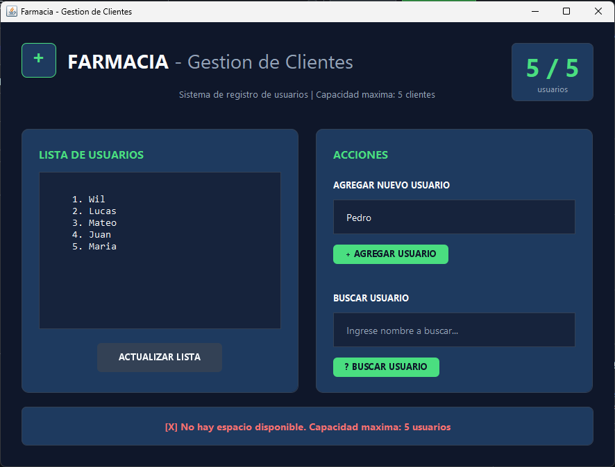

# 💊 Sistema de Gestión de Usuarios - Farmacia

Sistema desarrollado en **Java Swing** para gestionar una lista de usuarios (clientes) de una farmacia, utilizando un arreglo simple de 5 posiciones máximo.

## 📋 Requisitos Implementados

| Puntos | Requisito | Estado |
|--------|-----------|--------|
| 10 pts | Arreglo de 5 usuarios (clientes de la farmacia) | ✅ |
| 10 pts | Método `listarUsuarios()` que muestre todos los usuarios | ✅ |
| 10 pts | Método `agregarUsuario(String usuario)` - solo si hay espacio | ✅ |
| 10 pts | Método `buscarUsuario(String usuario)` - indica si existe o no | ✅ |
| 10 pts | Pruebas | ✅ |

## 🛠️ Tecnologías Utilizadas

- **Java 21**
- **Java Swing (JFrame)** - Interfaz gráfica
- **Maven** - Gestión de dependencias

## 📁 Estructura del Proyecto

```
src/main/java/com/mycompany/gestionusuarios/
├── Farmacia.java        # Vista principal (JFrame) con UI moderna
├── UsuarioService.java  # Lógica de negocio (arreglo y métodos)
└── RoundedButton.java   # Componente personalizado con bordes redondeados
```

## ▶️ Cómo Ejecutar

### Opción 1: Maven (Terminal)
```bash
mvn compile exec:java
```

### Opción 2: NetBeans
1. Abrir el proyecto en NetBeans
2. Clic derecho en `Farmacia.java` → **Run File**

## 🎨 Diseño de la Interfaz

La interfaz cuenta con:
- Paleta de colores moderna (azul oscuro + verde menta)
- Bordes redondeados en paneles y botones
- Contador visual de usuarios (0/5)
- Mensajes de feedback con colores (verde éxito, rojo error)

## 🧪 Pruebas Realizadas

### Prueba 1: Listar usuarios (vacío)
> Al abrir la aplicación, muestra "No hay usuarios registrados"

### Prueba 2: Agregar usuarios
> Se pueden agregar hasta 5 usuarios exitosamente

### Prueba 3: Capacidad máxima
> Al intentar agregar el 6to usuario, muestra mensaje de error "No hay espacio disponible"

### Prueba 4: Buscar usuario existente
> Muestra mensaje "Usuario ENCONTRADO en el sistema"

### Prueba 5: Buscar usuario no existente
> Muestra mensaje "Usuario NO existe en el sistema"

---

## 📸 Capturas de Pantalla

### Vista Principal


### Agregar Usuario


### Buscar Usuario


### Capacidad Máxima


---

## 👤 Autor

- **Nombre:** Wilmer Ogosi
- **Curso:** Programación en Java - Semana 4

